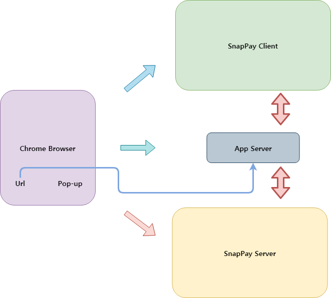
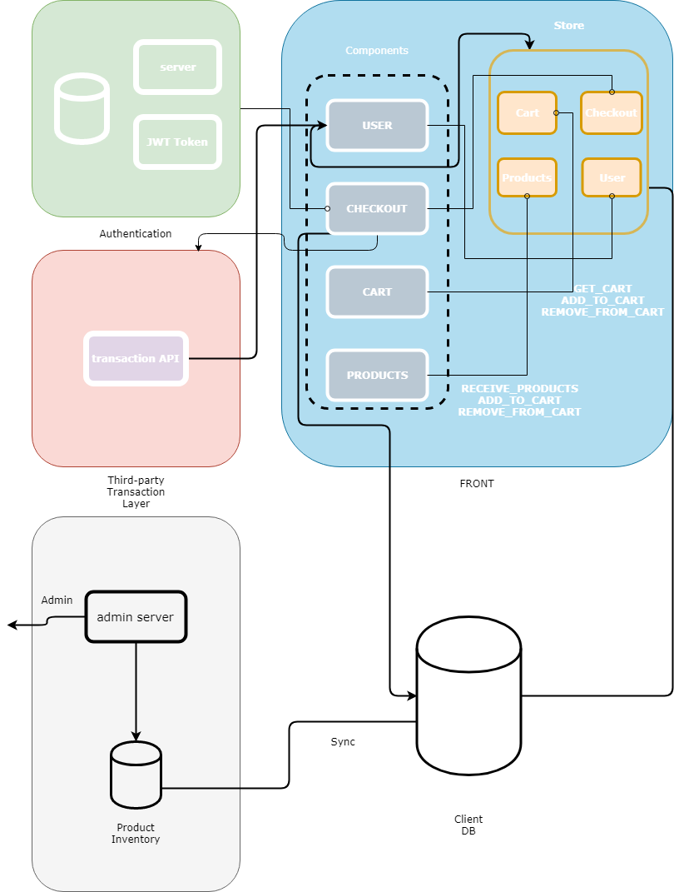

# SnapPay

Client/Server side for SnapPay :point_up_2:

- [SnapPay](#snappay)
    - [SnapPay Client Design Doc :blue_book:](#snappay-client-design-doc-blue_book)
        - [Overview](#overview)
            - [Working scenarios :clipboard:](#working-scenarios-clipboard)
            - [Thoughts on Tech Stacks :bulb:](#thoughts-on-tech-stacks-bulb)
            - [Client design :page_with_curl:](#client-design-page_with_curl)
                - [UI Components](#ui-components)
                - [System Design](#system-design)
            - [misc stacks](#misc-stacks)
    - [TODO](#todo)
    - [Takeaways](#takeaways)

## SnapPay Client Design Doc :blue_book:

### Overview

A Chrome Extension that retrives url, uploads products, and let other users buy stuffs with simple url-based shopping and transaction features.



**_UPDATE: SnapPay Server -> SnapPay Admin _**

#### Working scenarios :clipboard:

1. When an user added a product to the url, SnapPay extension detects it from the server
   - input: url, link to server storage for product added url
   - output: chrome.notification
   - issues: how to effectively communicate with server in chrome side (background.js?)
2. User can see added product in SnapPay, add it to SnapPay Cart, and checkout
   - input: ProductData (product name, price, quantity, and stuffs), CartData (ProductData, price, UserData), User Authentification (OAuth? JWT?)
   - output: Transaction Class (thinking of [iamport](https://www.iamport.kr/), [naver pay](https://developer.pay.naver.com/)...)
   - issues: how to send user+cart data to transaction server/api?
   - problems:
3. Users can see what they bought and ordered on their own profile pages
   - input: UserData + transaction/order data from app server
   - output: profile page

#### Thoughts on Tech Stacks :bulb:

What should I use for this app?
I might need:

- Single Page Application for simplicity
- Good state management across pages and tabs
- extensibility and fairly good scalabilty

sooooo I picked VueJs, but it was not enough.
Vanilla vue lacks 1) routing, 2) state management when it goes crazy, 3) weak typing cuz of javascript.

To fix this, I added some options:

- typescript for static typing
- vue-router for smooth routing
- vuex for elegant store/state management

Seems like vue-cli w/ webpack template was the best option for me to pull it off.

p.s. typescript got me suffer with its type checking, but it worths it. So much easier for debugging...

#### Client design :page_with_curl:

##### UI Components

```text
Main.vue // Main page wrapper for the extension
|--NavBar.vue // page navigation using vue-router
|--Products.vue // when notification fires up, users can see this page
    |--Product.vue
|--Cart.vue // when user adds products to cart, they can go see their cart
|--Checkout.vue // checkout page, probabily need to show transaction page
|--Profile.vue // profile page
Option.vue // just in case...
```

##### System Design

Client side pseudo-logic



#### misc stacks

- Database: sqlite3 or aws rds (to leverage cloud...)
- connection w/ servers: axios
- third party transaction api: Naver Pay? or Iamport

## TODO

- Client
  - Is there any way to simplify the system more?
- Server
  - Should it eventually migrate to AWS EC2 and AWS RDS...? or nah

## Takeaways

- 2018-10-25 - Should draw a diagram before start coding, bro... It actually got me understand how it should be and how I want it to be
